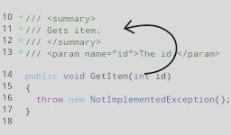
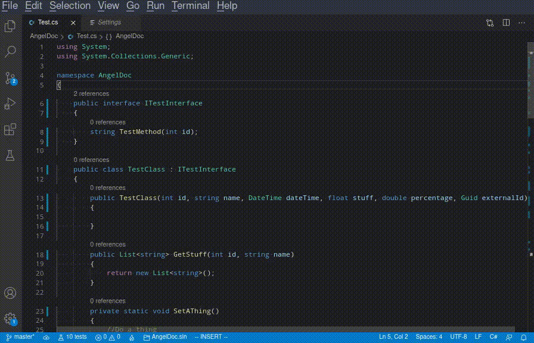

# angeldoc-vscode

AngelDoc is an open-source replacement for GhostDoc.

## Features

AngelDoc inserts pre-filled xml doc snippets for C# symbols.
Currently supported are:

* Classes
* Interfaces
* Constructors
* Methods
* Fields
* Properties

## Requirements

vscode ^1.46.0

## Extension Settings

This extension contributes the following settings:

* `angeldoc-vscode.insertxmldoconslash`: enable/disable inserting of xmldocs when inserting three consecutive slashes('/')

## Known Issues

AngelDoc does not integrate with Omnisharp-vscode (Otherwise known as the VS Code C# extension you probably already use) and uses a stand-alone .net binary to get info about the symbol you are documenting. This is so that it can work accross multiple editors. For the time being it will be stuck with this and that will limit future possiblities, but for now it achieves it's goals well enough.